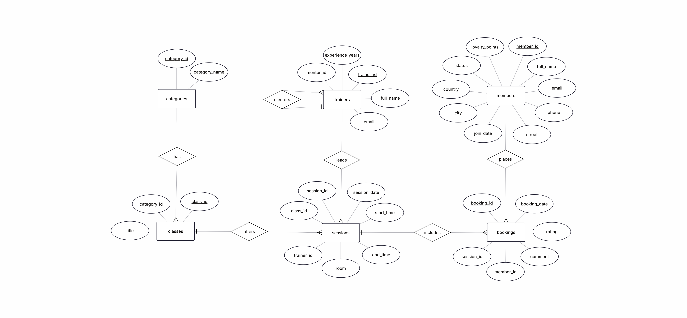
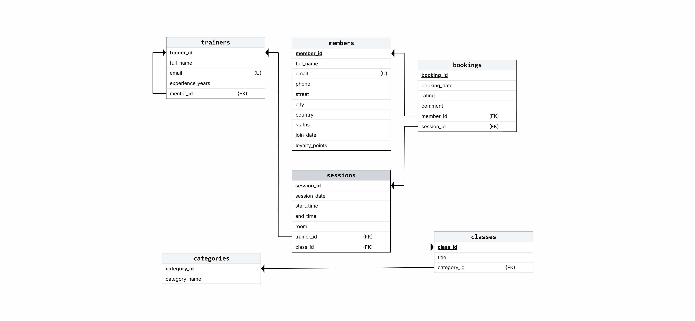

<div align="center">

# 🏋️ FitZone Gym Management System

**A robust, scalable PostgreSQL database solution for managing modern fitness centers.**

[](#)
[](#)
[](#)

</div>

---

## 📌 Overview

**FitZone** is a comprehensive relational database system built using **PostgreSQL**. It is engineered to streamline operations for fitness centers by effectively handling member subscriptions, trainer assignments, class schedules, bookings, and complex hierarchical trainer mentorship.

---

## 📐 Database Architecture & Diagrams

### 1. Conceptual Entity-Relationship Diagram (ERD)


### 2. Relational Database Schema


---

## 📂 Repository Structure

```text
fitzone-gym-database/
│
├── fitzone_database.sql     # Complete PostgreSQL database script (DDL & DML)
├── fitzone_erd.png          # Conceptual Entity-Relationship Diagram
├── fitzone_schema.png       # Detailed Relational Database Schema
└── README.md                # Project documentation
